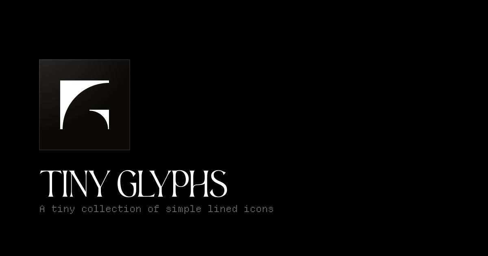

# TinyGlyphs



A collection of simple lined icons with multi-framework support and tree-shaking optimization.

## Quick Start

### Installation

```bash
# npm
npm install tinyglyphs

# yarn
yarn add tinyglyphs

# pnpm
pnpm add tinyglyphs
```

### Usage

#### React

```tsx
import { HeartIcon, StarIcon, SearchIcon } from "tinyglyphs/react";

function App() {
  return (
    <div>
      <HeartIcon size={24} color="red" />
      <StarIcon size={20} strokeWidth={2} />
      <SearchIcon className="search-icon" />
    </div>
  );
}
```

#### Vue

```vue
<script setup>
import { HeartIcon } from "tinyglyphs/vue";
</script>

<template>
  <div>
    <HeartIcon :size="24" color="red" />
    <StarIcon :size="20" :strokeWidth="2" />
    <SearchIcon class="search-icon" />
  </div>
</template>

<script setup>
import { HeartIcon, StarIcon, SearchIcon } from "tinyglyphs/vue";
</script>
```

#### Svelte

```svelte
<script>
  import { HeartIcon, StarIcon, SearchIcon } from "tinyglyphs/svelte";
</script>

<div>
  <HeartIcon size={24} color="red" />
  <StarIcon size={20} strokeWidth={2} />
  <SearchIcon class="search-icon" />
</div>
```

#### Angular

```typescript
// app.component.ts
import { Component } from "@angular/core";
import { HeartIconComponent, StarIconComponent } from "tinyglyphs/angular";

@Component({
  selector: "app-root",
  template: `
    <div>
      <heart-icon [size]="24" color="red"></heart-icon>
      <star-icon [size]="20" [strokeWidth]="2"></star-icon>
    </div>
  `,
  imports: [HeartIconComponent, StarIconComponent],
  standalone: true,
})
export class AppComponent {}
```

## Icon Props

All icons accept these props:

| Prop                  | Type               | Default          | Description                           |
| --------------------- | ------------------ | ---------------- | ------------------------------------- |
| `size`                | `number \| string` | `16`             | Icon size in pixels                   |
| `color`               | `string`           | `"currentColor"` | Icon color                            |
| `strokeWidth`         | `number \| string` | `1`              | Stroke width                          |
| `absoluteStrokeWidth` | `boolean`          | `false`          | Whether stroke width scales with size |
| `className`           | `string`           | `undefined`      | CSS class name                        |

Plus all standard SVG props (`onClick`, `onMouseOver`, etc.).

## Framework Support

Supported frameworks:

- React - `tinyglyphs/react`
- Vue - `tinyglyphs/vue`
- Svelte - `tinyglyphs/svelte`
- Angular - `tinyglyphs/angular`

The package uses subpath exports to provide framework-specific entry points while keeping everything in a single package.

## Examples

### Basic Usage

```tsx
import { HomeIcon, UserIcon, SettingsIcon } from "tinyglyphs/react";

<HomeIcon />                        // Default: 16px, currentColor
<UserIcon size={24} />              // Custom size
<SettingsIcon color="#3b82f6" />    // Custom color
```

### Styling

```tsx
// With Tailwind CSS
<HeartIcon className="w-6 h-6 text-red-500 hover:text-red-600" />

// With custom CSS
<HeartIcon className="my-icon" />
```

```css
.my-icon {
  width: 1.5rem;
  height: 1.5rem;
  color: #ef4444;
  transition: color 0.2s;
}

.my-icon:hover {
  color: #dc2626;
}
```

### Interactive Icons

```tsx
<button onClick={() => console.log("Liked!")}>
  <HeartIcon size={20} className="hover:text-red-500" />
</button>
```

### Dynamic Properties

```tsx
const [liked, setLiked] = useState(false);

<HeartIcon
  size={24}
  color={liked ? "#ef4444" : "#6b7280"}
  onClick={() => setLiked(!liked)}
  className="cursor-pointer transition-colors"
/>;
```

## Performance

Individual icons are small when tree-shaken. Only import what you use:

```tsx
// Good - only HeartIcon is bundled
import { HeartIcon } from "tinyglyphs/react";

// Avoid - imports entire library
import * as Icons from "tinyglyphs/react";
```

## License

MIT © [Ankur Chauhan](https://ankur.design)
